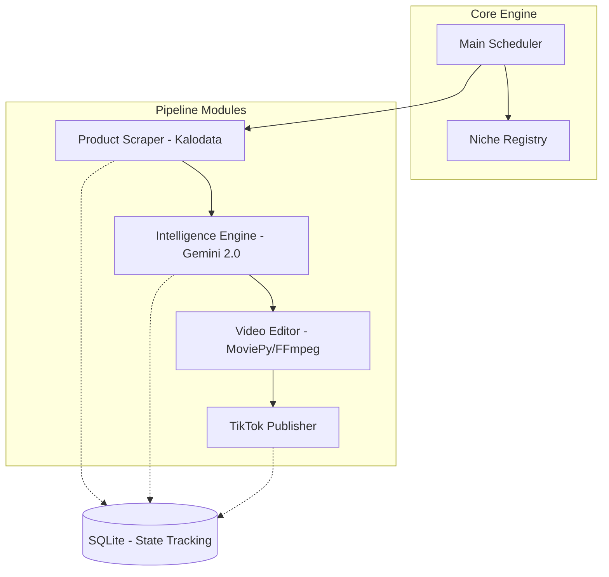

# Low-Level Design (LLD): Autoffiliate

## 1. System Overview
Autoffiliate is a modular Python-based automation engine designed to orchestrate the TikTok Affiliate lifecycle. The system is built around a pluggable pipeline architecture that supports multiple niches through configuration.

### 1.1 Directory Structure
```text
.
├── config/
│   ├── niches/          # YAML files for each niche (e.g., fashion.yaml)
│   └── prompts/         # System instructions for Gemini
├── sessions/            # TikTok session cookies/data
├── data/
│   └── database.sqlite  # State tracking
├── src/
│   ├── scraper/         # Kalodata scraping logic
│   ├── intelligence/    # Gemini 2.0 script generation
│   ├── editor/          # MoviePy/FFmpeg assembly
│   └── publisher/       # TikTok posting automation
├── compose.yaml
├── dc.sh
└── main.py              # Entry point (Runner)
```

### 1.2 High-Level Architecture


## 2. Tech Stack Selection

| Component | Choice | Rationale |
|-----------|--------|-----------|
| **Language** | Python 3.11+ | Superior AI SDKs, scraping libraries, and media processing. |
| **AI Reasoning** | Gemini 2.0 | Advanced multimodal capabilities and high reasoning for script variety. |
| **Video Editing** | MoviePy / FFmpeg | Flexible programmatic video assembly. |
| **Database** | SQLite | Lightweight, file-based tracking of product/video status. |
| **Infrastructure** | Docker | Consistent development and deployment environment. |
| **Orchestration** | compose.yaml | Manage multi-container services (App + Cron/Worker). |
| **Utility Script** | dc.sh | Standardized wrapper for Docker commands. |

## 3. Module Decomposition

### 3.1 Niche Registry
The Niche Registry is a directory-based configuration system located in `config/niches/`. Each niche is defined by a YAML file, allowing for easy expansion without code changes.

**Example: `config/niches/fashion.yaml`**
```yaml
niche_id: fashion_pilot
active: true
schedule: "0 9,15,21 * * *" # 3x per day
scraper:
  category: "Women's Fashion"
  min_sales_30d: 500
  keywords: ["dress", "skirt", "outfit"]
ai:
  tone: "energetic, trendy"
  language: "id" # Indonesian
  system_prompt_ref: "prompts/fashion_v1.txt"
editor:
  font: "Outfit-Bold"
  music_style: "lofi-beats"
  overlay_color: "#FF0055"
publisher:
  account_name: "fashion_trends_id"
  session_path: "sessions/fashion_pilot.json"
```

### 3.2 Main Runner (Orchestrator)
The Runner is a stateful service that:
1. Loads all `active` niches from the Registry.
2. For each niche, checks the schedule.
3. Triggers the Pipeline (Scrape -> Script -> Render -> Post) for the specific niche context.
4. Updates the SQLite database to ensure the same product isn't processed twice across different niches (unless explicitly allowed).

### 3.2 Product Scraper
Interacts with Kalodata to identify "Hot Products".
- **Input:** Search criteria from Registry.
- **Output:** Structured product data (ID, Title, Image URLs, Selling Points).

### 3.3 Intelligence Engine (Gemini)
Transforms raw product data into persuasive marketing scripts.
- **Input:** Product data + Niche prompts.
- **Output:** Text-to-speech (TTS) scripts, Overlay text, and Visual cues.

### 3.4 Video Editor
Assembles final video assets.
- **Input:** Product images/videos + Script + Niche assets.
- **Logic:**
    - Use MoviePy 2.x for high-performance assembly.
    - Automatic image resizing for 9:16 vertical format.
    - Dynamic text overlay rendering with ImageMagick.
- **Output:** Unique MP4 file in `data/videos/`.

### 3.5 TikTok Publisher
Handles the final upload and description.
- **Input:** MP4 + Generated Caption + Hash tags.
- **Logic:** Automated login/upload flow with human-like interactions.

## 4. Data Architecture

### 4.1 Schema (SQLite)
- **`products`**: `id`, `niche_id`, `source_url`, `title`, `price`, `sales_30d`, `image_urls`, `raw_data`, `created_at`
- **`contents`**: `id`, `product_id`, `script`, `video_path`, `status` (PENDING, READY, POSTED)
- **`post_history`**: `id`, `content_id`, `tiktok_url`, `views`, `posted_at`

## 5. Security & Safety
- **Credential Management:** Use `.env` files for API keys and session tokens.
- **Anti-Spam:**
    - Dynamic MD5 hashing via slight metadata/frame shifts.
    - Randomized posting windows.
    - Varied transition durations.

## 6. ADRs

### ADR-001: Python Core
- **Status:** Accepted
- **Context:** Need for rapid integration with AI and media libraries.
- **Decision:** Use Python 3.11+.

### ADR-002: Playwright for Scaping/Posting
- **Status:** Accepted
- **Context:** TikTok and Kalodata have complex JS-heavy UIs.
- **Decision:** Use Playwright with stealth-plugin to minimize detection.

### ADR-003: SQLite Tracking
- **Status:** Accepted
- **Context:** Need to avoid double-posting and track video performance.
- **Decision:** Use SQLite for simplicity and local persistence.
### ADR-004: Dockerization
- **Status**: Accepted
- **Context**: Need for consistent environments across development and deployment, especially with complex dependencies like FFmpeg and Playwright.
- **Decision**: Containerize the application using Docker.
- **Consequences**: Standardized `dc.sh` command for all operations.
