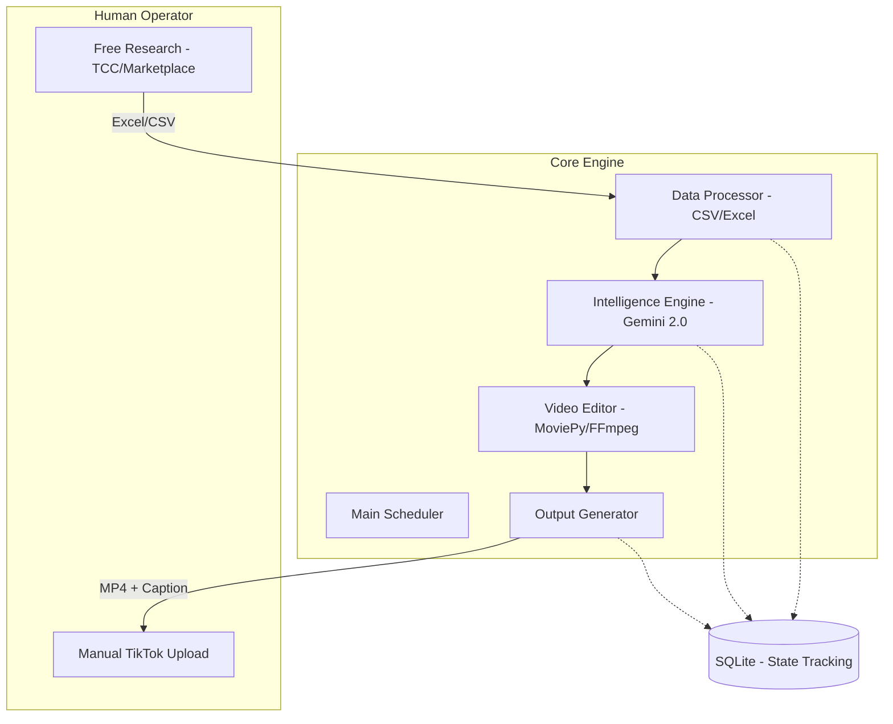

# Low-Level Design (LLD): Autoffiliate (Semi-Auto)

## 1. System Overview
Autoffiliate is a modular Python-based engine designed to automate the video generation phase of the TikTok Affiliate lifecycle. In this **Semi-Auto** configuration, data sourcing and final posting are handled by a human operator to maximize account safety and data accuracy.

### 1.1 Directory Structure
```text
.
├── config/
│   ├── niches/          # YAML files for each niche
│   └── prompts/         # System instructions for Gemini
├── data/
│   ├── input/           # Human-provided CSV/Excel (TCC, Marketplace, Kalodata)
│   ├── assets/          # Downloaded/Local product assets
│   ├── videos/          # Generated ready-to-post videos
│   └── database.sqlite  # State tracking
├── src/
│   ├── processor/       # CSV/Excel parsing and data validation
│   ├── intelligence/    # Gemini 2.0 script generation
│   ├── editor/          # MoviePy/FFmpeg assembly
│   └── output/          # Preparing captions and metadata for manual post
├── compose.yaml
├── dc.sh
└── main.py              # Entry point (Runner)
```

### 1.2 High-Level Architecture (Semi-Auto)


## 2. Tech Stack Selection

| Component | Choice | Rationale |
|-----------|--------|-----------|
| **Language** | Python 3.11+ | Superior AI SDKs and media processing. |
| **Data Parsing** | Pandas / Openpyxl | Robust handling of Excel/CSV formats. |
| **AI Reasoning** | Gemini 2.0 | Advanced multimodal capabilities for script generation. |
| **Video Editing** | MoviePy / FFmpeg | Flexible programmatic video assembly. |
| **Database** | SQLite | Lightweight tracking of processed products. |
| **Infrastructure** | Docker | Consistent environment for FFmpeg and dependencies. |

## 3. Module Decomposition

### 3.1 Data Processor
Parses files provided by the human operator in `data/input/`.
- **Input:** Excel/CSV from TikTok Shop Marketplace, TCC, or Kalodata.
- **Output:** Validated product objects (Title, Price, Shop, Video Links).
- **Validation:** Ensures mandatory fields are present and deduplicates against the database.

### 3.2 Intelligence Engine (Gemini)
Transforms product data into persuasive marketing scripts.
- **Input:** Product metadata + Niche prompts.
- **Output:** Narrations, Overlay text, and Visual storyboard cues.

### 3.3 Video Editor
Assembles final video assets.
- **Input:** Product assets (images/videos) + Script.
- **Logic:**
    - Automatic 9:16 vertical formatting.
    - Dynamic text overlays and transitions.
    - Asset randomization to ensure uniqueness.
- **Output:** Unique MP4 file in `data/videos/`.

### 3.4 Output Generator
Prepares the "Post Package" for the human operator.
- **Input:** Generated MP4 + Gemini-generated captions/hashtags.
- **Output:** A structured folder or summary file that makes manual posting as fast as possible (e.g., `data/output/{date}/{product}/`).

## 4. Data Architecture

### 4.1 Schema (SQLite)
- **`products`**: `id`, `source_id` (from Kalodata), `title`, `price`, `processed_at`
- **`contents`**: `id`, `product_id`, `script`, `video_path`, `status` (PENDING, GENERATED, ARCHIVED)

## 5. ADRs

### ADR-005: Semi-Auto Strategy Pivot
- **Status:** Accepted
- **Context:** Fully automated scraping and posting are high-risk for account bans and data extraction complexity.
- **Decision:** Shift to human-assisted scraping (CSV export) and manual posting.
- **Consequences:** Removal of `scraper` (Playwright) and `publisher` (Automation) modules in favor of `processor` and `output` modules. Focus shifts to generation speed and video quality.
